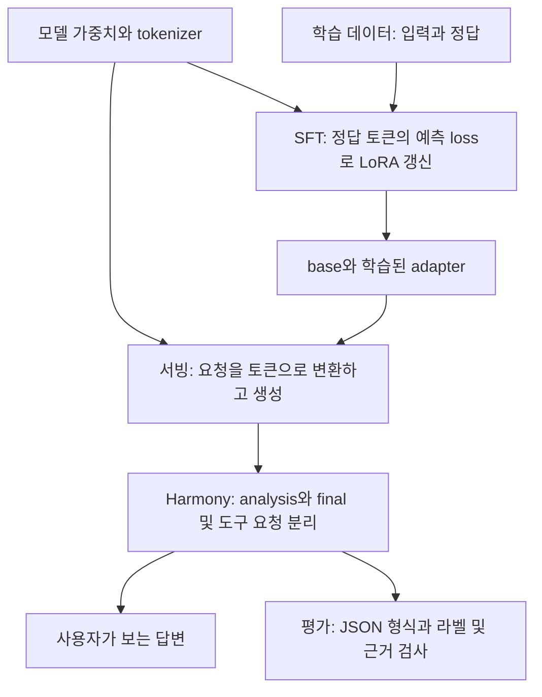

# GPT-OSS-20B: vLLM 서빙과 판단 학습 결과의 차이

작성일: 2026-10-05. 분석 대상은 `official-tutorial-v5-max-steps-100`이며,
동일 조건의 30스텝 실험을 비교 자료로 사용한다. 실험 조건과 결과 수치의 정본은
[파인튜닝 실험 기록](FINETUNING_EXPERIMENT_PLAN.md#2026-10-04-official-tutorial-v5-max-steps-100)이다.

## 1. 지금 확인된 결론

**최근 100스텝 실행은 완료됐지만, 이것만으로 학습 구현이 정상이라고 판정할 수는
없다. 2026-10-05 추가 GPU 진단에서 저장·재로딩 가중치와 loss 산출을 대조했고,
낮은 loss와 높은 토큰 적중률이 판단 성능을 과장하는 현상을 확인했다.**
별도 validation 100건의 정답 접두사 제공 진단에서 adapter loss는 0.0893,
토큰 적중률은 94.5%였으나 두 라벨 선택 일치율은 56%였다. 양성 50건 중 40건을
놓쳤다. 이는 자유 생성 또는 test500 성적이 아니다. 추가 진단과 제한은
[11절](#11-2026-10-05-전체-입출력과-실제-forward-재점검)에 기록한다.
실행 완료, 학습 수치의 건전성, 판단 성능, 생성 계약 준수를 각각 확인해야 한다.

사용자는 GPT-OSS-20B를 vLLM으로 서빙했을 때 CWE 기반 분류, 선정 이유, 추천 사항이
잘 나왔다고 보고했다. 그 관측은 이번 결과와 양립한다. 이번에 학습한 정답은
설명이나 추천 사항 없이 `assessment` 하나만 반환하는 JSON이고, 평가 또한 지정된
CWE의 존재 여부와 이 한 필드 계약을 검사한다. 두 작업의 목표가 다르다.

이번 점검에서 구분한 상태는 다음과 같다.

| 확인할 상태 | 100스텝 실행에서 확인한 내용 |
| --- | --- |
| 학습 실행 | 100 optimizer step 완료, 기록된 loss·gradient norm 모두 유한 |
| 실제 파라미터 변경 | trainable tensor 3,264개 중 3,178개의 최종 hash 변경 |
| adapter 저장·추론 | 저장된 adapter를 별도 생성 프로세스가 로드하여 10회 생성 완료 |
| 학습 중 validation loss | 공식 설정 `eval_strategy=no`이므로 측정하지 않음 |
| 학습 후 생성 평가 | validation의 같은 2건을 5개 생성 상한으로 반복, base/adapter 합계 20회 완료 |
| 전체 품질 검증 | test500 미사용, 이유·추천 사항의 품질도 평가하지 않음 |
| 학습 프레임워크 결함 | 최신 실행의 결과만으로 확정할 근거 없음 |

초기 분석은 로그·코드·CPU tokenizer 검사였으며, 11절부터는 추가 GPU forward
진단이다. 기존 학습·생성 실험 조건은 수정하지 않았다. 정전 후 확인에서 30스텝 manifest의 97개, 100스텝 manifest의 104개
artifact hash가 모두 일치했다. 원 실험의 출력과 manifest는 그대로 보존했다.

## 2. 먼저 구분할 개념: 모델, 서빙, 학습, 평가

GPT-OSS-20B는 답변을 만들어 내는 모델이다. vLLM은 그 모델을 불러와 요청을 받고
토큰을 생성하며 API 응답으로 전달하는 추론 엔진이다. 이번 Unsloth 경로는 모델을
불러와 LoRA를 학습하고, 학습 전후에 `model.generate()`로 직접 생성하는 경로다.
“vLLM에서는 된다”와 “Unsloth 학습 후 특정 평가에 실패한다”는 서로 다른 단계에
대한 관측이다.

vLLM의 chat API는 메시지 직렬화, 샘플링 설정, 응답 파싱을 포함한다. 기본 생성값도
모델 저장소의 `generation_config.json`을 적용할 수 있으므로, 두 엔진에서 옵션을
생략했다는 사실만으로 같은 생성 조건이 되지는 않는다.
[vLLM 0.21.0 서버 문서](https://docs.vllm.ai/en/v0.21.0/serving/openai_compatible_server/)



서빙은 주어진 가중치로 생성한다. 학습은 데이터에 맞도록 가중치의 일부를 바꾼다.
평가는 그 결과가 사전에 정한 계약을 만족하는지 검사한다. 화면에 설명이 잘 나온
사례는 기본 모델의 유용한 능력에 대한 근거이고, strict JSON 실패는 자동 평가에
사용할 수 있는 답변을 안정적으로 생성하지 못한 근거다. 둘 중 하나로 나머지 모든
단계의 성공·실패를 대신 판단할 수 없다.

## 3. SFT에서는 실제로 무엇을 배우는가

### 3.1 정답을 끝까지 직접 생성해 보고 채점하는 방식이 아니다

SFT는 학습 데이터의 정답 토큰을 앞에서부터 제공하고 다음 정답 토큰의 예측 확률을
높인다. 이를 teacher forcing이라고 부른다. 현재 경로의 손실을 간단히 쓰면 다음과
같다. `S`는 loss를 계산하는 위치이고, `x`는 입력, `y`는 정답이다.

```text
loss = -(1 / |S|) × Σ log P(정답 토큰 y[t] | 입력 x, 앞선 정답 토큰 y[:t])
```

자유 생성에서는 앞선 **자기 출력**을 이어서 사용한다. 정답 접두사를 보고 다음
JSON 토큰을 잘 예측하는 것과, analysis부터 시작해 올바른 채널·판단·완결된 JSON까지
스스로 도달하는 것은 다른 검증이다. token cross-entropy와 masking의 기준은
[사용한 TRL 0.22.2 문서](https://huggingface.co/docs/trl/v0.22.2/en/sft_trainer)에 설명돼 있다.

### 3.2 이번 정답은 매우 짧은 판단 JSON이다

데이터 위치는 `data/processed/cc-source-candidates-20260928-v5/decision-candidates/`다.
입력은 요청한 CWE ID, 제공된 함수, 판단 범위와 출력 지시다. assistant 정답은
다음 두 형태뿐이다.

```json
{"assessment": "present"}
```

```json
{"assessment": "not_observed"}
```

10,000건을 확인한 결과 `present` 5,000건, `not_observed` 5,000건이었다.
선정 이유·근거 줄·추천 사항을 정답으로 제공하지 않았다. 출력 계약은 `uncertain`도
허용하지만 이 학습 정답에는 `uncertain` 사례가 없다. 이것은 확인된 목표·데이터의
차이이며, 모델이 반드시 불확실성 표현을 잃었다는 인과 증명은 아니다.

현재 tokenizer에서 완전한 supervised target은 종료 토큰을 포함해 `present` 7토큰,
`not_observed` 9토큰이다. 두 target은 JSON 구조와 종료에 해당하는 6토큰을 공유한다.
그러므로 전체 target loss만으로 CWE 지식, 라벨 선택, 이유의 정확성을 각각 알 수
없다. loss를 낮추면서 구조를 익혔을 가능성과 판단을 개선했을 가능성을 별도로
검증해야 한다.

### 3.3 공식 final-only mask가 평가하는 범위

공식 예제는 assistant의 final 시작 표식 이후에만 직접 loss를 계산한다.
이 예제의 final-only 규칙은 그대로 사용했다.
[고정한 Unsloth 공식 예제](https://github.com/unslothai/notebooks/blob/92e38e86308748d18fc4cd4b104c4c6d3db1d67e/python_scripts/gpt-oss-%2820B%29-Fine-tuning.py)

우리 role/content 데이터를 현재 tokenizer로 렌더링할 때 이 final 표식이 나오도록
**학습용 사본에만 `thinking: ""`를 추가했다**. 원본 메시지의 content와 v5 원본은
보존했다. 따라서 학습 assistant 영역은 다음 구조다.

```text
assistant analysis: [빈 내용]          ← 직접 loss 제외
assistant final header                ← 직접 loss 제외
{"assessment": "present"}<|return|>   ← 직접 loss 계산
```

추론 입력은 `<|start|>assistant`에서 끝나며, 모델이 채널과 답변을 생성한다.
실제로 모든 이번 생성에는 analysis가 나타났다. 학습의 빈 analysis와 추론의 수백
토큰 analysis는 입력 분포가 다르며, analysis에서 final로 전환하는 표식을 이번
target이 직접 감독하지 않는다. 이 차이가 형식 이탈이나 analysis/final 불일치에
기여했을 가능성은 **가설**이다. 파라미터를 공유하므로 final 학습이 다른 동작에
간접적으로 영향을 줄 수 있고, mask 자체를 곧바로 버그라고 단정할 수는 없다.

### 3.4 LoRA는 기본 능력을 보존하라는 제약을 자동으로 보장하지 않는다

LoRA는 고정한 원 가중치에 학습 가능한 작은 행렬의 변화를 더한다.
개념적으로 `W_effective = W_base + (alpha/r) × B × A`다. 원 가중치를 고정해도
adapter가 적용된 전체 모델의 출력 분포는 달라진다.
[PEFT LoRA 개념 문서](https://huggingface.co/docs/peft/main/en/conceptual_guides/lora)

따라서 기본 모델이 설명을 잘 생성하던 사실과, 짧은 판단 target에 적응한 adapter가
같은 설명·지시 준수를 유지하는지는 별개다. 현재 실험에는 설명 품질을 유지하는지
검사하는 평가가 없으므로, 그 능력이 실제로 유지됐거나 손상됐다고 결론 낼 수 없다.

## 4. vLLM에서 잘 보인 답변과 이번 실험의 조건 비교

| 비교 항목 | 사용자가 보고한 vLLM 서빙 | 이번 공식 예제 + v5 판단 실험 |
| --- | --- | --- |
| 작업 목표 | CWE 기반 분류, 선정 이유, 추천 사항 제공 | **주어진 CWE 하나**가 함수에 관측되는지 판단 |
| 출력 내용 | 분류와 설명이 있는 답변 | `assessment` 한 필드, 다른 필드 금지 |
| CWE 선택 | 당시 요청 원문이 없어 후보 선정 범위 미확인 | CWE ID가 입력에 이미 지정됨 |
| 평가 방법 | 유용한 답변이 보였다는 사용자 관측 | final 채널 → JSON → 정확한 필드 → 원천 라벨 일치 |
| 모델 실체 | 당시 checkpoint·revision·양자화·adapter 여부 미확인 | `unsloth/gpt-oss-20b`가 BnB NF4 checkpoint로 해석됨 |
| 실행 경로 | vLLM 서버 | Unsloth 로더 + Transformers `generate` |
| 생성 설정 | 요청·서버 옵션 미확인 | sampling, temperature=1, top_k=50, top_p=1, reasoning=medium |
| 출력 후처리 | 당시 UI/API 처리 미확인 | 원 token IDs를 저장하고 Harmony final을 평가 |
| 실험 규모 | 사례 수·라벨 검수 여부 미확인 | validation 고유 2건, test500 미사용 |

이번 분석에서는 과거 vLLM 성공 사례에 대응하는 요청·응답·서버 옵션을 확보하지
못했다. 문서에 남은 vLLM 0.21.0은 환경 snapshot이지, 사용자 사례가 그
버전과 그 옵션으로 실행됐다는 증거는 아니다. 이번 문서에서 과거 사례를 실패로
재분류하거나, 당시와 동일 조건으로 비교했다고 주장하지 않는다.

### 4.1 같은 GPT-OSS-20B라는 이름도 충분한 동일 조건은 아니다

이번 실험의 실제 base는 `unsloth/gpt-oss-20b-unsloth-bnb-4bit`, revision
`093fba6992ef5a7152481afec0bdfca1ac486998`이며 NF4·bf16 compute·double quant다.
공식 OpenAI checkpoint는 MoE 가중치의 MXFP4 사용을 명시한다.
[GPT-OSS-20B 공식 모델 카드](https://huggingface.co/openai/gpt-oss-20b)

과거 vLLM이 공식 MXFP4 checkpoint를 사용했다면 지금의 NF4 checkpoint와 양자화
표현이 다르다. **과거 모델이 무엇이었는지는 미확인**이므로 이 차이를 원인으로
확정할 수 없다. tokenizer, chat template, 샘플링, adapter 적용 여부와 수치 커널도
비교 대상이며, 이름과 “4bit”만 맞추면 모든 조건이 일치하는 것은 아니다.

### 4.2 vLLM의 API 응답과 raw generation은 표현 계층이 다르다

확인한 vLLM 0.21.0 chat serving 코드는 `model_type == gpt_oss`이면 Harmony 경로를
선택한다. non-streaming 응답에서는 token IDs를 파싱하여 `reasoning`과 `content`를
분리하며, streaming도 채널 상태를 추적한다. 이는 GPT-OSS에 일반 모델의 문자열
처리만 적용하는 것과 차이가 있다.
[vLLM 0.21.0 GPT-OSS 처리 코드](https://docs.vllm.ai/en/v0.21.0/api/vllm/entrypoints/openai/chat_completion/serving/)

이번 `generate`는 raw 토큰을 돌려준다. 처음의 단순 final 문자열 검사에는 누락이
있었고, 뒤에 공식 Harmony 파서로 별도 재평가했다. 이 차이는 “화면에서는 정상
답변이 보이는데 평가에서는 final이 없다고 나온다”를 설명할 수 있다. 다만 이를
고친 뒤에도 실제 tool handoff, 추가 필드, 라벨 불일치는 남았다.

vLLM에는 JSON schema를 지정하는 structured output 기능도 있다.
[vLLM 0.21.0 구조화 출력 문서](https://docs.vllm.ai/en/v0.21.0/features/structured_outputs/)
과거 사례가 이 기능을 썼는지는 확인되지 않았다. 이번 직접 생성에는 schema 강제
디코딩을 넣지 않았다. 형식을 제어하는 기능이 의미적 판단의 정답을 보장하는 것도
아니므로, 사용 여부를 기록하고 형식과 내용 점수를 나누어야 한다.

## 5. 100스텝에서 “안 됐다”는 결과를 오류 유형별로 해석

아래는 **20호출, 고유 validation 2건**의 분류다. 한 호출은 하나의 유형에 넣었고,
파서의 과거 누락은 별도 기록했다. 동일 2건의 반복 호출을 전체 데이터 정확도로
해석하지 않는다.

| 유형 | base 10호출 | adapter 10호출 | 의미 |
| --- | ---: | ---: | --- |
| 생성 상한 소진, final 없음 | 3 | 2 | analysis 생성 중 예산 종료 |
| tool handoff, final 없음 | 2 | 1 | `<\|call\|>`로 제어를 넘기는 응답 |
| 추가 필드로 schema 실패 | 0 | 1 | JSON 문법은 맞지만 한 필드 계약 위반 |
| 원천 라벨 기준 FN | 1 | 1 | source `present`, final `not_observed` |
| 원천 라벨 기준 FP | 0 | 1 | source `not_observed`, final `present` |
| 유효한 `uncertain` | 1 | 0 | 허용된 보류, exact source-label match는 아님 |
| schema 유효 + 원천 라벨 일치 | 3 | 4 | 이 판단 계약에서 성공 |
| 합계 | 10 | 10 | 실행 예외·timeout은 0 |

### 5.1 짧은 생성 예산: 확인된 종료 원인

128토큰 조건은 base와 adapter 모두 2건씩 예산을 소진했다. base의 CWE-252 512토큰
조건도 final 이전에 끊겼다. `max_new_tokens`는 이 실행에서 final JSON뿐 아니라
analysis와 채널 표식도 포함한 생성 예산이다. JSON이 7–9토큰으로 짧다고 해서 전체
생성도 7–9토큰이면 되는 것은 아니다.

그러나 큰 예산에서 실패한 adapter 응답은 각각 1,062토큰(FN), 648토큰(tool),
550토큰(FP), 752토큰(추가 필드)에서 이미 native EOS로 종료됐다. 예산은 충분히
남아 있었다. 이 실패들을 131,072 문맥 부족이나 외부 timeout으로 설명할 수 없다.
입력은 293/235토큰이며, 이 실험은 긴 입력을 이해하는 능력을 시험한 것도 아니다.

### 5.2 tool handoff: 본래 제어 토큰이지만 이번 작업에서는 목적 이탈

adapter의 CWE-190 / 2,048 조건은 analysis에서 `not_observed`를 여러 번 검토한 뒤,
정의하지 않은 `function_contains_cwe`를 `functions.run`으로 요청하는 메시지를
생성하고 `<|call|>`에서 종료했다. base에도 같은 종료 유형이 두 번 있었다.
실제 도구를 실행한 것은 없으며, 이번 harness에는 도구 실행 후 재개하는 loop도 없다.

기록된 native EOS는 `[200002, 199999, 200012]`다. `200012`는 `<|call|>`로, 이
생성 경로가 도구 요청에서 멈춘 직접 이유다. 이것을 “정답 JSON을 완성했다”로
해석하거나, 더 오래 기다리면 final이 이어졌을 것으로 해석하면 안 된다.

CPU 검사에서는 **`tools` 인자를 주지 않아도 현재 chat template가 `functions`
호출은 commentary 채널로 보내라는 문장을 입력에 넣는 것**을 재현했다.
Transformers 4.56.2는 template에 `tools=None`을 전달하고, template의 해당 조건은
값의 유무 대신 `tools is defined`를 검사한다. 실제 함수 정의는 들어가지 않았다.

이것은 원문·소스·CPU 재현으로 확인한 prompt의 불일치다. 이 문장이 허구 도구
호출을 유발했는지는 동일 조건에서 문장 하나만 바꾸는 대조 실험이 필요하다.
모델이 원래 도구 호출을 생성할 수 있다는 점도 있으므로, 곧바로 유일 원인이라고
단정하지 않는다. 기존 template나 native EOS를 이번 분석 중 수정하지 않았다.

### 5.3 평가 파서: 우리 평가 코드에 있었던 확인된 누락

초기 코드는 `<|channel|>final<|message|>`라는 정확한 문자열만 찾았다.
실제 응답 중에는 final과 message 사이에 `<|constrain|>` 메타데이터가 있었다.
공식 Harmony 파서는 이 경우에도 final 채널과 본문을 추출한다.
[공식 Harmony 라이브러리](https://github.com/openai/harmony)

100스텝에는 이런 final 누락이 3건 있었다. base512의 `uncertain`, base2048의 FN,
adapter 최대 문맥의 추가 필드 JSON이다. 이미 별도 `scored-results.json`에 재평가한
결과를 반영했고, 원본 literal 검사 기록도 보존했다. **final이 회복된 3건을 모두
정답 성공 3건으로 바꾼 것은 아니다.** `uncertain`, FN, schema 실패는 그대로다.
기존 파서 회귀 검사 9건의 통과 기록도 있다.

이 문제는 학습 오류가 아니라 평가 구현의 문제다. 설명할 때 두 종류를 섞지 않는다.

### 5.4 추가 필드: 의미상 라벨이 맞아도 출력 계약에는 실패

adapter의 CWE-190 / 남은 최대 문맥 응답은 `assessment: not_observed`를 반환했다.
그러나 `target_cwe`와 `source_code` 필드도 추가했기 때문에 schema 실패다.
analysis부터 “출력에는 세 필드가 있어야 한다”고 지시를 잘못 재구성한 흔적이 있다.
실제 입력 지시는 `assessment` 하나만 허용했다.

이 경우 “JSON 파싱이 안 됐다”는 표현은 부정확하다. JSON 문법은 유효하고,
assessment 값 자체는 원천 라벨과 같다. 자동 처리 계약을 따르지 못한 실패다.
vLLM에서 설명이 풍부하게 나온 성공 기준이라면 추가 내용이 유용할 수 있지만,
현재 판단 계약에서는 그것이 실패가 되는 이유도 여기에 있다.

### 5.5 CWE 지식 오류와 analysis/final 불일치

adapter의 CWE-252 / 2,048 응답은 CWE-252를 `Unchecked Input Conversion` 등으로
잘못 설명한 채 검토를 이어 갔고 final은 `not_observed`였다. base의 같은 조건에도
CWE-252를 permission/syntax 문제로 잘못 설명하는 현상이 있었다.
실제 CWE-252는 **Unchecked Return Value**다.
[MITRE CWE-252 정의](https://cwe.mitre.org/data/definitions/252.html)

이것은 읽은 응답에 나타난 지식 오류이며, 입력이 CWE ID만 제공한다는 조건과
관련해 점검할 대상이다. base에도 나타났으므로 “adapter 학습이 이 오류를 새로
만들었다”는 인과는 입증되지 않았다. CWE 이름을 함께 주는 대조가 식별에 도움이
되겠지만, 아직 실행하지 않았다.

또한 analysis/final의 일치 여부는 별도 문제다. adapter의 CWE-190 / 65,536 응답은
analysis 후반에서 `not_observed`라고 결론 내고도 final에는 `present`를 출력했다.
이는 원천 라벨 기준 FP다. 반대로 CWE-252 / 512 응답도 analysis는 `not_observed`로
마무리되지만 final은 `present`라서 원천 라벨 일치로 집계됐다.

즉, **현재 표의 성공 건에도 올바른 이유를 설명했다는 보장은 없다**.
생성된 analysis는 모델의 내부 계산을 완전하게 증명하는 자료가 아니지만, 적어도
화면에 표시될 설명과 final 판단 사이의 모순을 직접 확인하는 자료다. CWE-190의
정의도 integer overflow/wraparound이며, 단순히 범위 검사가 없다는 말과 동일한
판단은 아니다.
[MITRE CWE-190 정의](https://cwe.mitre.org/data/definitions/190.html)

## 6. 데이터·학습에서 확인된 제한과 미확정 원인

### 6.1 데이터 파일 형식이 정상인 것과 학습 의미가 충분한 것은 다르다

v5는 원천 라벨에 기반한 판단 후보이며 사람의 근거 검수가 완료된 정답셋은 아니다.
현재 두 validation 함수에는 호출된 함수의 구현이나 구조체 필드 타입 등의 문맥이
없다. 예를 들어 CWE-252 사례에서 호출되는 `file_synch_write`의 선언·구현·반환값
계약은 제공되지 않는다. 이 정보를 확인하지 않고 원천 라벨과 다른 모든 판단을
확정적인 보안 오판으로 간주할 수는 없다.

그래서 표의 FP/FN은 **원천 라벨 기준**이다. CWE 이름을 잘못 설명한 사실이나
analysis/final 모순은 이 라벨 검수 여부와 별도로 확인된 오류다.

### 6.2 1,024토큰 학습 길이가 실제 train 구성을 바꿨다

공식 학습 길이 1,024를 유지하면 긴 입력 뒤의 정답이 잘릴 수 있다. 실제 native
mask와 CPU 감사를 10,000건 모두 대조했으며 결과는 다음과 같다.

| 항목 | 건수 |
| --- | ---: |
| 원 train 후보 | 10,000 |
| 전체 길이 1,024 초과 | 1,490 |
| 정답이 모두 잘려 제외된 행 | 1,475 |
| 완전한 JSON + 종료 토큰 target | 8,510 |
| 정답 일부만 남은 행 | 15 |
| 실제 유효 train | 8,525 |

원 후보는 5,000/5,000 균형이지만 실제 유효 train은 `present` 3,831건,
`not_observed` 4,694건이다. 잘림이 클래스 구성을 바꿨다는 점은 확인됐다.
완전한 정답이 아닌 15행이 남아 있는 것도 정리할 대상이다. 다만 이 행들이 이번
100스텝에 얼마나 노출됐는지나 개별 오류의 원인이었는지는 이번 분석으로 입증하지
않았다. 실제 유효 target 대부분은 완전하므로 “전체 데이터가 망가졌다”는 결론도
맞지 않는다.

### 6.3 100스텝은 10,000건 전체를 학습했다는 뜻이 아니다

batch1 × gradient accumulation4 × 100step이므로 약 400번의 예제 제시다.
기록된 epoch는 0.0469208이다. 이를 400개의 서로 다른 예제라고 단정하거나,
train10,000건을 한 번 모두 학습했다고 해석하면 안 된다.

이번 평균 train loss는 0.130558, 마지막 step은 0.086이었다. validation loss는
공식 설정대로 측정하지 않았다. 이 상태에서 과적합, 학습 부족, 설명 능력 손상,
Unsloth backward/forward 버그 중 하나를 확정하려면 근거가 더 필요하다.
같은 실행에서 NaN·OOM·timeout이 없었다는 사실이 모든 구현 결함을 배제한다는
뜻도 아니다.

### 6.4 30 → 100 결과는 안정적인 성능 하락의 인과 증명이 아니다

| adapter 생성 상한 | 30step schema / 원천 일치 | 100step schema / 원천 일치 |
| --- | --- | --- |
| 128 | 0/2 · 0/2 | 0/2 · 0/2 |
| 512 | 0/2 · 0/2 | 2/2 · 2/2 |
| 2,048 | 2/2 · 2/2 | 1/2 · 0/2 |
| 65,536 | 2/2 · 2/2 | 2/2 · 1/2 |
| 131,072 − 입력 길이 | 2/2 · 2/2 | 1/2 · 1/2 |

초기 가중치, 데이터, 생성 코드, 설정은 대조했다. 그러나 생성은 sampling이고
각 호출의 RNG를 고정·되감기하지 않았다. 각 토큰 상한은 같은 생성의 긴 접두사를
얻는 실험이 아니라 새로운 무작위 생성이다. 학습을 전혀 하지 않은 base 결과도
두 실험 사이에 달라졌다. 따라서 “길이를 늘려서 오답이 됐다” 또는 “100스텝이면
반드시 퇴화한다”라고 읽을 수 없다.

또한 학습 `max_steps`만 바꿨지만 공식 linear scheduler의 총 길이도 자동으로
바뀌었다. 100스텝 실행은 새 base에서 시작했으며 30스텝 adapter에 70스텝을 이어
학습한 것이 아니다. 첫 30스텝 중에도 기록된 learning rate가 24스텝에서 다르다.
현재 결론은 **loss는 낮아졌으나 이 2건 진단에서 일관된 생성 품질 개선은 확인하지
못했다**까지다.

## 7. 이후 원인을 나누어 검증하는 순서

아래는 제안이며 이번 분석에서 실행하지 않았다. 기존 공식 recipe 결과를 보존하고
새 실험 ID에서 변수를 하나씩 바꾸는 방식이다. 새 timeout, 강제 종료 토큰,
final prefill 등을 기존 조건에 몰래 추가하지 않는다.

| 순서와 실험 이름 | 고정할 것 / 확인하거나 바꿀 것 | 식별할 질문 |
| --- | --- | --- |
| 1. `serving-vs-training-inference-parity` | 과거 성공의 checkpoint·revision·adapter 여부·요청·응답·서버 옵션 확보. 같은 작업·최종 입력 token IDs·sampling·EOS·파서·예산을 대조 | 실제 모델 출력 차이인가, 작업과 표시·평가 조건 차이인가? |
| 2. `functions-notice-only-ablation` | 학습된 가중치와 입력 나머지를 유지하고, 함수 정의 없이 들어간 functions 안내 문장만 비교 | 허구 tool handoff가 이 안내에 영향을 받는가? |
| 3. `cwe-title-only-ablation` | 같은 함수·출력 계약에 CWE ID와 공식 이름을 함께 제공하는 조건만 비교 | CWE 번호의 잘못된 회상이 원천 라벨 불일치에 기여하는가? |
| 4. `complete-targets-1024` | 현재 길이와 recipe를 유지하며 완전한 target만 내보낸 새 학습 사본·클래스 구성을 명시 | target 잘림의 영향을 분리할 수 있는가? |
| 5. `decision-and-reviewed-rationale` | 판단 목표와 이유·추천 목표를 합의하고, 검수된 근거 정답·별도 지표·기본 설명 능력 비교를 준비 | 제품이 원하는 설명 품질을 실제로 학습·유지·평가하는가? |

1번에서 같은 양자화 checkpoint나 adapter를 두 엔진이 동일하게 지원하지 않으면
그 차이를 별도 요인으로 남겨야 한다. 다른 가중치로 대체하고 엔진 차이라고만
부르면 비교가 성립하지 않는다. decoder 실험에서는 동일 seed 목록의 반복 sampling
등 재현 가능한 계획을 새 조건으로 기록하고, 기존 공식 기본 sampling 결과와
구분한다. 다른 엔진에서 같은 seed가 같은 출력을 보장한다고 가정하지 않는다.

라벨 판단은 우선 두 진단 사례부터 필요한 외부 문맥과 원천 정보를 사람이 검수한다.
반복해서 본 validation 사례는 development 진단으로만 사용하고, 최종 test500은
학습과 조정에 섞지 않는다. 설명·추천 평가를 추가한다면 근거 일치, unsupported
claim, 판단과 설명의 일치, 추천의 적합성도 평가해야 한다. 기존 판단 schema나
metric을 이번 문서 작성 중 변경한 것은 아니다.

## 8. 보고할 때 사용할 표현

| 기존에 혼동을 만드는 표현 | 이 실행에 맞는 표현 |
| --- | --- |
| “Unsloth에서 학습이 안 됐다” | “100스텝 학습·adapter 저장은 완료됐고, 생성 품질의 일관성이 부족했다” |
| “validation이 실패했다” | “학습 중 eval loss는 설정상 미측정이며, 학습 후 2건 생성 진단에서 일부 실패했다” |
| “JSON 파싱 오류다” | “final 추출 누락 / final 없음 / JSON 문법 / schema 위반을 구분한다” |
| “큰 토큰 한도도 실패하니 context가 부족하다” | “큰 한도 실패는 실제 생성 종료와 예산 소진을 먼저 확인한다” |
| “이유와 추천을 학습했는데 안 나온다” | “현재 정답은 판단 한 필드이고, 이유·추천의 정답과 지표는 없다” |
| “30보다 100이 나쁘므로 과적합이다” | “2건 sampling 진단에서 일부 조건이 나빠졌고, 과적합 인과는 미검증이다” |

## 9. 재현 자료와 검증 범위

원 실행은 RTX A6000 1장, Python3.12.13, torch2.14.1+cu130, Transformers4.56.2,
TRL0.22.2, Unsloth2026.9.14(commit `5971d280d4b645c8d470d6bb3171b082c4d4d2b8`),
Zoo2026.9.9(commit `867a86383371ebeb8ab1948d085540d134c07b4c`)이다.
원 실행의 package 목록과 GPU·command·source hash는 기존 manifest와 보고서에 있다.
이번 추가 점검은 stdlib 수집기와 기존 환경의 **CPU tokenizer**만 실행했다.

| 자료 | 위치 |
| --- | --- |
| 30스텝 원본 | `outputs/cc-official-tutorial-v5-token-caps-20261004-v1/` |
| 100스텝 원본·원 token IDs | `outputs/cc-official-tutorial-v5-max-steps-100-20261004-v1/` |
| 정정된 평가 정본 | 100스텝 폴더의 `scored-results.json` / `scored-results.md` |
| 학습·mask·비교 근거 | `training.json`, `dataset-audit.json`, `audit.json`, `step30-vs-step100.json` |
| 추가 오류 분류와 원본 hash | `outputs/cc-official-tutorial-step100-error-analysis-20261005-v1/evidence.json` |
| CPU template·target 검사 | 같은 추가 분석 폴더의 `tokenizer-audit.json` |
| 원 출력 증거 | 모델·예산·sample ID를 이름으로 가진 `.json` / `.txt`; 이 문서에는 raw code를 복제하지 않음 |

```bash
python3 outputs/cc-official-tutorial-step100-error-analysis-20261005-v1/collect_evidence.py
experiments/unsloth-official-tutorial-generation-64-20261004-v1/.venv/bin/python outputs/cc-official-tutorial-step100-error-analysis-20261005-v1/tokenizer_audit.py
```

두 명령은 학습·추론을 실행하지 않는다. 수집기는 원 manifest hash와 오류 분류 합계를
assert로 확인한다. tokenizer 재렌더링에는 분석일의 날짜가 들어가므로 과거 입력
token IDs와 동일하다고 주장하지 않으며, 원 입력은 변경하지 않는다.
생성된 증거·로그는 Git 제외 경로에 두고 이 문서는 사람이 정리한 해석을 기록한다.


## 11. 2026-10-05 전체 입출력과 실제 forward 재점검

사용자가 요청한 원인 재검토에 따라 “학습 완료 = 구현 정상”이라는 추정을 제거했다.
이번 작업은 재학습이 아니다. optimizer step 0회, backward 0회이며, 새 자유 생성도
수행하지 않았다. 기존 두 실험과 adapter, 생성 실험표, test500을 보존했다.

### 11.1 전체 데이터 연결 및 기존 출력 확인

원천 canonical과 decision-candidates의 train 10,000건·validation 1,000건에서
코드·CWE·라벨 연결을 검사했다. 원본 train과 `thinking: ""`를 추가한 사본, 실제
30/100스텝 Arrow 캐시의 input IDs·attention mask·모든 label 위치를 전수 대조했다.
재구성 불일치 0건, 30/100 캐시 불일치 0건이며 유효 인덱스 8,525건도 일치했다.
이는 코드·라벨 연결과 직렬화 검사이지 11,000건의 보안 정답을 사람이 검수한 결과가
아니다. 동일 `(CWE, source_code)` 입력의 상충 라벨은 train에서 발견되지 않았다.

기존 40회 생성은 고유 validation 입력 2건의 반복이다. 원문을 읽어 입력·정답·final·
전체 생성문을 연결한 검토 파일을 만들었다. 주된 결과 분류는 예산 소진 10회,
도구 요청 4회, 채널 헤더 1회, schema 1회, uncertain 4회, 원천 라벨 불일치 3회,
원천 라벨 일치 17회다. analysis/final 모순 2회는 이 분류와 별도로 표시했다.

Git 제외 자료:

- `outputs/cc-official-tutorial-v5-input-output-audit-20261005-v1/summary.json`
- 같은 폴더의 `all-generations.json`, `all-input-outputs.md`, `review.html`
- `audit_io.py`, `build_viewer.py`: 전수 검사 및 오프라인 비교 화면 재생성 코드

HTML은 외부 전송 없이 로컬에서 입력·정답·final·전체 원문을 비교한다. 40건의 포함과
HTML escaping을 검사했으며 브라우저 자동 렌더링 검사는 수행하지 않았다.

### 11.2 저장·재로딩 및 loss 계산 자체 검사

100스텝 종료 시 기록된 LoRA 3,264개 tensor hash를 safetensors와 하나씩 비교하고,
Unsloth로 다시 로드한 실제 파라미터와도 비교했다. 모두 일치했고 전부 finite였다.
패키지 7개의 설치 RECORD와 Python 소스를 대조했으며 변조된 파일은 없었다.
이 검사는 파라미터가 올바르게 저장·로딩됐다는 근거이며 backward/optimizer의
수학적 정확성 전체를 보증하는 검사는 아니다.

train의 완전한 정답을 가진 최단·최장 입력과 기존 validation 2건에서 동일 입력·
가중치를 고정했다. 학습 모드+grad, 학습 모드+no_grad, 평가 모드+no_grad의
12회 forward를 수행했다. 마지막 hidden state와 LM head로 다음 토큰 CE를 별도
계산했으며 모델 loss와 최대 약 4.5e-8 차이로 일치했다.

| 입력 | 토큰 | 학습 모드+grad loss | 평가 모드+no_grad loss |
| --- | ---: | ---: | ---: |
| train index 2550 | 230 | 0.175363 | 0.175383 |
| train index 5380 | 1,024 | 0.082984 | 0.091078 |
| validation CWE-252 | 309 | 0.139886 | 0.139877 |
| validation CWE-190 | 253 | 0.031640 | 0.028360 |

이전 4,096토큰·구버전 환경에서 관측된 `0.128509 → 6.291219` 같은 차이는 최신
환경의 이 4건에서는 재현되지 않았다. 과거 원인은 해결됐다고 소급 판정하지 않으며,
4건의 검사를 전체 runtime 정상 증명으로 확대하지 않는다. 최초 진단의 첫 train
forward는 0.188223으로 재실행 값과 달랐고, 아래 반복 수치 진단에도 기록했다.

최초 진단에서 평가 모드+grad 조합은 eager attention의 `matmul(out=...)`가
자동미분을 지원하지 않아 실패했다. 실제 학습 모드는 train이고 실제 평가는 no_grad다.
이 추가 진단 실패를 원 학습 실패로 집계하지 않고 로그를 보존했다. 원본 조건을
바꾸는 패키지 패치나 강제 logits 설정을 적용하지 않았다.

### 11.3 낮은 loss가 가렸던 실제 판단 성능

기존 generation table과 별개로 validation 파일 순서에서 라벨별 첫 50건을
선택했다. 전체 렌더링이 1,024토큰 이하인 완전한 입력만 사용했으며 각 50건을 채우면
선택을 종료했다. 선택 ID·원본 hash·전체 IDs를 `probe-inputs.json`에 고정했다.
원천 라벨은 여전히 미검수 상태이며, 이 표본을 전체 분포의 대표 표본으로 주장하지 않는다.

정답 접두사와 empty analysis/final을 제공한 teacher-forced forward에서 첫 판단
토큰 `present`와 `not`의 logit만 비교했다. 동일한 두 선택의 조건부 확률을 사용하고
동률은 `not_observed`로 처리했다. prefix를 이미 제공한 **진단**이므로 기존 bare
assistant 자유 생성 성적, 최종 test 정확도 또는 완성된 JSON 생성률이 아니다.

| 진단 지표 | base | 100스텝 adapter |
| --- | ---: | ---: |
| 평균 sequence loss | 1.261358 | 0.089278 |
| 정답 토큰 적중률 | 75.125% (601/800) | 94.5% (756/800) |
| 두 라벨 조건부 선택 일치 | 47/100 | 56/100 |
| 판단 외 나머지 토큰 적중 | 600/700 | 700/700 |
| 양성 50건 중 선택 성공 | 7 | 10 |
| 음성 50건 중 선택 성공 | 40 | 46 |

base의 무제약 첫 판단 token argmax는 98건에서 두 라벨 밖에 있었다. 따라서 base
47%는 두 후보로 제한한 진단 점수이고 자유 생성 정확도가 아니다. adapter의 해당
argmax는 100건 모두 두 라벨 안에 있었으며, 조건부 선택과 일치했다.

adapter의 confusion matrix는 다음과 같다. 행은 원천 라벨, 열은 진단 선택이다.

| 원천 라벨 | present 선택 | not_observed 선택 |
| --- | ---: | ---: |
| present | TP 10 | FN 40 |
| not_observed | FP 4 | TN 46 |

양성 재현율 20%, 음성 재현율 92%이며 100건 중 86건을 `not_observed`로 선택했다.
정답 토큰 800개 중 판단 분기 100개를 제외한 700개는 전부 맞혔다. **형식과 고정
후속 토큰을 맞힌 덕분에 token accuracy 94.5%와 loss 0.089가 나오면서도 핵심
판단은 56%인 현상**이 직접 확인됐다. 100건만으로 통계적 향상이나 악화를 확정하지 않는다.

참고로 고정 토큰을 완벽하게 맞히고 두 라벨을 매번 확률 0.5로 예측하는 가상 모델은
현재 7/9토큰·라벨 균형 조건에서 평균 sequence loss가
`(ln(2)/7 + ln(2)/9)/2 = 0.088019`다. 이는 계산상 비교 기준이며 실측 모델이
무작위로 판단한다는 증명은 아니다. 실제 조건부 이진 CE는 base 0.879242,
adapter 0.674474였다. 낮은 전체 loss만 보고 판단 학습 성공을 선언할 수 없다.

### 11.4 학습과 실제 사용 사이에 남은 두 가지 문제

**첫째, 학습량과 유효 표본이 제한적이다.** max_steps 100, batch 1, accumulation 4로
약 400회 표본 제시이며 기록된 epoch는 약 0.0469다. 10,000건을 한 번씩 학습한
실험이 아니다. 1,024토큰 상한으로 1,475건은 정답이 전부 잘려 제외되고, 15건은
부분 정답만 남았다. 양성/음성 5,000/5,000이 실제 유효 데이터에서는 3,831/4,694다.
CWE-252는 원본 train에 양성 3건뿐이고 유효 데이터에는 양성 2건만 남는다.
실제 학습 batch별 ID 기록은 없어 이 2건을 이번 100스텝에서 봤는지는 미확인이다.
따라서 데이터 범위·노출 부족은 강한 점검 대상이지만 개별 오류의 인과를 입증한 것은 아니다.

**둘째, 학습 목표와 생성 경로가 다르다.** 학습은 빈 analysis 뒤 final JSON 7/9토큰만
직접 감독한다. 실제 생성은 bare assistant에서 medium reasoning으로 시작한다.
analysis 내용, analysis를 끝내는 동작, final 채널 전환은 직접 loss 대상이 아니다.
기존 40회 출력은 모두 analysis부터 시작했다. 이 불일치는 데이터·마스크·출력으로
확인됐지만, 이를 고치면 실패가 얼마나 줄어드는지는 통제 실험이 필요하다.
현재 데이터로 CWE 근거·선정 이유·추천 사항까지 학습했다고 주장할 수 없다.

이 두 문제와 형식 위주의 loss 해석 문제를 우선 해결해야 한다. 생성 상한만 늘리는
것은 잘못된 분류 또는 학습되지 않은 채널 전환을 직접 고치는 조치가 아니다.
다음 학습 전에는 판단 지표(양성 재현율/FN 포함)와 생성 계약 지표를 분리해 validation에
기록하고, 완전한 정답이 남는 길이·표본 범위를 점검해야 한다. 판단 전용 학습을 유지할지,
reasoning/채널 전환까지 감독할지는 통제 실험 조건으로 명시한다. 이번 조사에서는
학습 recipe, 마스크, 생성 옵션 또는 데이터셋을 임의로 수정하지 않았다.

### 11.5 추가로 발견한 MoE 수치 민감도와 판단 한계

동일 validation CWE-252의 input position 306에 있는 정답 `present`를 `not` 토큰으로
치환하고, 그보다 앞선 position 305의 logit을 비교했다. 평가 모드+no_grad에서는
모든 logit 차이가 정확히 0이었다. 학습 모드+grad에서는 최대 0.09375 차이가
관측돼 원문 반복과 치환을 번갈아 확인했다. 첫 위치만 추적한 진단에서는 최대
0.140625였으며, 전체 prefix 추적 진단에서는 0.09375였다. hook 유무와 실행 경로의
차이도 존재하므로 이 숫자를 모든 입력의 오차 상한으로 사용하지 않는다.

전체 prefix를 layer별로 추적했을 때 첫 비영 차이는 0-based layer 5의 MLP/MoE
출력 4.76837158203125e-7이었다. layer 11 MLP에서 0.0380859375 차이가 나타났고,
이후 layer로 전파됐다. 앞선 attention 출력에 선행 차이가 없었다. 같은 원문을
반복한 경우는 비교한 prefix activation/logit이 모두 정확히 같았고, 모든 반복에서
첫 판단 argmax는 `not`였다. 가중치 hash도 변하지 않았다.

즉, 미래 토큰을 바꿀 때 학습 경로가 수치적으로 완전히 불변하지 않다는 현상은
재현됐다. 현재 관측은 MoE 연산의 토큰 묶음·routing·정밀도에 따른 수치 민감도를
점검할 근거다. **causal attention mask의 누출, 정답 복사, optimizer 오류 또는
기존 품질 실패의 주원인으로 확정한 것은 아니다.** 이를 판정하려면 동일 MoE
입력·가중치의 기준 연산과 커널 출력을 비교해야 한다. 이번 요청의 원인 점검에서는
이 미확인 부분까지 “정상”으로 덮지 않고 보존한다. full backward/optimizer 검산,
실제 Trainer 전체 루프 재현, 100건 전체의 train/eval 모드 대조는 수행하지 않았다.

### 11.6 추가 진단 재현 자료

Git 제외 경로는 `outputs/cc-native-forward-diagnostic-20261005-v1/`다.

| 자료 | 확인하는 내용 |
| --- | --- |
| `disk-integrity.json`, `load-integrity.json` | 종료 시점·파일·실제 로딩 3,264 tensor 일치 |
| `mode-matrix.json`, `complete.json` | 4건 × 3경로, 모델 loss와 수동 CE, 변경 없는 가중치 |
| `probe-inputs.json`, `probe-base.json`, `probe-adapter.json` | 고정 validation 100건, teacher-forced 상세값 |
| `summary.json`, `summarize.py` | 지표 집계, 원 실험 manifest 97/104개 재확인 |
| `future-token-probe.json` | 학습/평가 경로의 미래 토큰 치환 진단 |
| `causal-repeat.json`, `causal-prefix-repeat.json` | 반복 입력과 치환 입력, layer별 차이 |
| `installed-source-integrity.json`, `runtime-functions.json`, `runtime-*.py` | 실제 설치 소스와 실행 함수 |
| `diagnostic.log`, `diagnose-attempt1.py`, `mode-matrix-attempt1.json` | 최초 진단의 지원되지 않는 eval+grad 실패 보존 |
| `diagnostic-attempt2.log`, `probe-*.log`, `causal-*.log` | 성공한 진단의 원 로그 |

환경은 원 100스텝 실험과 동일한 native tutorial 가상환경이다. Python 3.12.13,
Unsloth 2026.9.14, zoo 2026.9.9, Transformers 4.56.2, TRL 0.22.2,
PEFT 0.21.2, torch 2.14.1+cu130, bitsandbytes 0.50.2, RTX A6000을 사용했다.
base는 기존 NF4 checkpoint revision `093fba6992ef5a7152481afec0bdfca1ac486998`,
adapter는 원 100스텝 safetensors SHA256
`4f0280021be433758f7ee6e1fc8d09f22846286ab6967892bd0cdbae9691b4b9`다.
네트워크 offline으로 캐시만 로드했다. 패키지 설치·수정이나 모델 다운로드는 없었다.

다음은 재현 명령이다. 새 진단은 원 실험 폴더와 분리된 폴더에서 실행했으며,
기록을 보존하려면 스크립트를 별도 진단 경로에 복사하고 출력 경로를 명시적으로
정한 뒤 실행한다. 그대로 재실행하면 진단 자체의 파일은 갱신될 수 있다.

```bash
cd outputs/cc-native-forward-diagnostic-20261005-v1
../../experiments/unsloth-official-tutorial-generation-64-20261004-v1/.venv/bin/python diagnose.py
../../experiments/unsloth-official-tutorial-generation-64-20261004-v1/.venv/bin/python decision_probe.py --model base
../../experiments/unsloth-official-tutorial-generation-64-20261004-v1/.venv/bin/python decision_probe.py --model adapter
../../experiments/unsloth-official-tutorial-generation-64-20261004-v1/.venv/bin/python causal_repeat.py
../../experiments/unsloth-official-tutorial-generation-64-20261004-v1/.venv/bin/python causal_prefix.py
python3 summarize.py
```

최종 해석: 형식 학습의 효과는 직접 확인됐지만, 충분한 판단 성능과 실제 생성 경로의
정합성은 확보되지 않았다. 낮은 loss를 성공으로 간주해 스텝·토큰 상한만 늘리는
방식은 현재 증거로 정당화되지 않는다. runtime 수치 민감도는 별도 미해결 항목이며,
이를 포함한 확인 범위를 넘어서 “Unsloth 학습 불가” 또는 “학습 코드 완전 정상”
어느 쪽으로도 단정하지 않는다.

### 11.7 Astra 원인 분석의 2차 확인

같은 날 이전 진단의 원 JSON과 코드를 다른 집계 스크립트로 다시 확인했다.
`outputs/astra-step100-report-review-20261005-v1/review.py`와 `review.json`이
재현 자료다. 새 모델 추론·학습·test500 접근은 없다.

- 100건의 base/adapter 입력 ID·원천 라벨·정답 토큰 수가 각각 일치한다. 평균 loss,
  47/100·56/100 두 라벨 선택, 601/800·756/800 토큰 적중, adapter의
  TP10/FN40/FP4/TN46이 원본 `probe-*.json`에서 그대로 재계산됐다.
- train 10,000건과 validation 1,000건 사이 동일 `(CWE, source_code)`는 0건이고,
  진단에 사용한 validation 100건의 train 중복도 0건이다. 이는 exact 검사이며,
  다른 종류의 근접 중복이나 보안 라벨의 정당성 전체를 새로 검증한 것은 아니다.
- 같은 100건을 쌍으로 비교하면 base만 맞힌 사례 6건, adapter만 맞힌 사례 15건,
  둘 다 맞힌 사례 41건, 둘 다 틀린 사례 38건이다. 불일치 21건의 탐색적
  양측 정확 검정값은 약 0.0784다. 따라서 이 균형 표본의 +9건을 전체 분포에서
  확실한 판단 성능 향상으로 일반화하지 않는다.

핵심 결론은 유지된다. **낮은 전체 토큰 loss는 판단의 품질을 대표하지 않는다.**
다만 이것은 성능 측정상 확인된 현상이지 “100스텝 부족”, “빈 analysis 학습”,
“원천 라벨 오류”, “MoE 수치 민감도” 중 어느 하나가 실패를 일으켰다는 인과
판정은 아니다. 진단이 제공한 정답 JSON 접두사, 인위적인 양성·음성 50/50 구성,
검수되지 않은 원천 라벨의 제한도 그대로 적용된다. 기존 자유 생성 2건 반복과
test500 성적을 이 100건 숫자로 대체하지 않는다.


### 11.8 생성 상한6조건 confusion matrix와13만token 추가

2026-10-05에 사용자가 요청한 생성 상한별 행렬을 집계했다. 기존5조건에
130000고정 생성 상한을 추가했으며 base/adapter각각 동일 validation2건이다.
새 자유 생성4회는 완료했고 새 학습은 없다. 상세 조건과 표는
[실험 기록](FINETUNING_EXPERIMENT_PLAN.md#2026-10-05-native-step100-max-new-tokens-130000-confusion-matrices)에 기록한다.

13만조건 adapter의 final 판단은 TP0/FN1/FP0/TN1이며 양성 응답에 추가 필드도
있었다. strict schema 기준으로는 FN 대신 양성invalid1, 음성TN1이다.
기존 최대 문맥 조건은 판단만 보면TP1/TN1이지만 음성 응답의 추가 필드 때문에
strict 기준TP1/음성invalid1이다. 두 기준을 혼동하지 않도록 확장 행렬과 원 출력,
입력·조건 일치검사·전체재집계를 Git 제외 경로
`outputs/cc-step100-max-new-tokens-130000-confusion-matrix-20261005-v1/`에 보존했다.

각조건양성1/음성1이며100건teacher-forced 진단과 다른 표본·평가다. sampling
기본값이므로 생성 상한 변화에 대한 단독 인과 실험으로 해석하지 않는다.

### 11.9 생성 조건별 표본 수 정정: validation100 자유 생성

2026-10-05 사용자가 조건별100건이 아닌2건만 표시된 점을 지적했다.
기존 generation 설정이 스모크 ID2건을 지정했고100step·130000확장에서도
그 설정을 재사용했기 때문이다. 11.7의100건은 teacher-forced 판단 진단이므로
생성 상한별100건 행렬을 대신하지 않는다. 기존2건 결과는 이력으로 보존한다.

새 실험 `cc-native-step100-validation100-token-caps-20261005-v1`은 기존100step
adapter와 base에 동일 validation100건(present50/not_observed50)을 적용한다.
128/512/2048/65536/130000/131072−입력, 모델별600회·전체1200회다.
학습은 다시 하지 않는다. 기존100건 진단의 ID만 재사용하고 생성 입력은
원 system/user뿐이다. 정답·teacher-forced 입력 token·final prefill을 넣지 않는다.
선정 표본은 전체 학습 렌더링1024 이하인 라벨별 첫50건이라 짧은 코드에 편향된
균형 진단이며 test500 평가가 아니다. 원천 라벨·CWE는 미검수다.

native sampling·medium reasoning·EOS를 유지하고 별도시간제한은 설정하지 않는다.
각 출력 JSON을 atomic 저장하고 완료된 요청을 건너뛰어 중단 후 재개한다.
final assessment 행렬과 엄격한 schema 행렬을 함께 저장하며 uncertain/invalid/pending을
분리한다. 각 그룹은 완료건수/100으로 표시하고 전체100건 완료 전에는 최종 성능을
주장하지 않는다. 최초 실행은2026-10-05T12:15:42Z에 시작했다. 결과가 아니라
**실행 시작 기록**이며 최신 진행은 출력 폴더의 progress.json을 확인해야 한다.

설정은 `configs/cc_native_step100_validation100_token_caps_v1.json`, 실행기는
`scripts/run_cc_native_validation100.py`다. 세부 조건·명령은 FINETUNING_EXPERIMENT_PLAN의
동일 제목 절에 기록했다. 원 환경·RTX A6000을 사용하고 packages.json/gpu.txt/
model별 runtime/launch.json/prepared.json/runner-source.py/verification.json/원 출력/
generation.log/confusion-matrices.json/.md를 보존한다. 입력100건·균형·중복·정답배제·
예산적합 검사와 pytest540개, 변경 파일ruff 및 mypy 검사를 통과했다.

이후 사용자가 W&B 기록을 요청하여 CPU sidecar로 저장된 평가 snapshot을 후등록하고
이후 변경을 자동 전송하도록 연결했다. 생성과 학습 조건은 변경하지 않았다.
[W&B evaluation run](https://wandb.ai/erad3254-looking-for-a-job/aegislm/runs/source-v2-evaluation-9d30dc7ec1290bd4)은
학습loss run이 아니며, 최초 채점170회와 완료된adapter128조건100건의 안전한 사례table/
semantic·strict confusion chart부터 전송했다. 전송 상태 및 원격 확인은
`wandb-progress.json`/`wandb-remote-verification.json`에 기록한다. raw 출력은 로컬에 보존한다.

### 11.10 2026-10-06: validation100 native 생성 OOM의 직접 원인

**학습이 아니라 생성기의 입력 처리(prefill)에서 발생한 GPU 메모리 부족이다.**
2026-10-06 00:05:39 KST, adapter/65536 조건의 세 번째 입력
`cc-8745b2417b18ebf598e0a8c4`에서 중단됐다. 입력825token이고
128/512/2048 조건은 각각100건 완료,65536은2건 완료,전체302/1200회다.
base와130000·최대문맥 조건은 아직 실행되지 않았다. 원 error.json과 원 출력을 보존했다.

| 관측 | 수치 / 결과 |
| --- | --- |
| GPU | RTX A6000, CUDA에서 보고한47.39GiB |
| 실패 당시 추가 요청 / 여유 | 13.05GiB / 13.01GiB |
| 실패 당시 해당 프로세스 사용 | 34.26GiB, PyTorch allocated33.88GiB |
| PyTorch reserved 중 unallocated | 약39.93MiB; 큰 비활성 캐시만 지우면 해결되는 상태가 아님 |
| 동일 입력의 이전2048실행 | 787token 생성 후 native EOS 정상 종료 |
| 새 프로세스 동일조건 진단 | 같은13.05GiB softmax OOM 재현, adapter hash 유지 |
| 실제 캐시 | StaticCache, full-attention StaticLayer 최대66360칸 |
| 마지막 입력 처리 layer 관측 | layer17, hidden shape[1,825,2880], 아직 첫 생성 token 이전 |

설치된 Unsloth2026.9.14 `models/vision.py`의 `unsloth_base_fast_generate`가
caller의 generation_config.cache_implementation=None을 실제호출에서는static으로
설정한다. 따라서 runtime JSON의None만 보고 dynamic cache라고 판단하면 틀린다.
observer로 `_old_generate`에 전달되는 실제 cache_implementation=static을 확인했다.
Transformers4.56.2는 input825+max_new_tokens65536−1=66360칸을 준비하고,
full-attention layer는 채워지지 않은 칸까지 포함한 길이를 계산에 사용한다.
이는 [동일 버전의 StaticCache 설명](https://huggingface.co/docs/transformers/v4.56.2/en/kv_cache#fixed-size-cache)의
최대길이 선할당 및 masked 위치에 대한 계산 낭비와 일치한다.

Unsloth Zoo2026.9.9 `temporary_patches/gpt_oss.py`는 inference에서
`inplace_eager_attention_forward`를 선택한다. 해당 함수는64개 attention head에
대해 `[batch, heads, query_length, kv_length+1]` attention 배열을 만들고
`F_softmax(..., dtype=torch.float32)`를 호출한다. +1은 attention sink다.
이번 FP32 배열 크기는 아래와 같으며 원 오류의13.05GiB와 일치한다.

```text
1 × 64 × 825 × 66361 × 4 bytes = 13.052898645 GiB
```

BF16 attention 배열도6.5264GiB이며 FP32 변환·출력과 모델·cache 등이 함께
살아 있어 순간 메모리가 부족해진다. 관찰된 cache/입력 shape와 설치 코드로 계산한
수치이며, OOM의 FP32 출력 배열 자체는 할당에 실패했으므로 직접 읽은 tensor는 아니다.
4bit는 모델 가중치 저장 형식으로, attention 임시 배열까지4bit가 되는 것이 아니다.
모델의131072 위치 한도도 현재 eager 추론경로에서 그 길이를48GB GPU로
처리할 수 있다는 보장이 아니다. 두 진술은 구분해야 한다.

앞선2건13만 생성 실험의 입력은293/235token으로, attention FP32 배열 추정치는
각9.10/7.30GiB였다. 이번100건은 입력이더길며 실패 입력825token의130000조건은
단일FP32배열만약25.73GiB로 추정된다. 65536의 첫2건도 입력487/572token으로
정상 종료했다. 따라서 짧은2건 성공을100건 최대문맥 실행 가능성으로 일반화한
사전검사가 부족했다. 단순 답변 반복이나6만token 실제생성 때문에 발생한 오류가 아니다.

새 GPU 프로세스에 원 모델·adapter·입력·예산·native defaults를 그대로 넣고
attention pre-hook과 `_old_generate` observer만 붙여6.10초 만에 같은 OOM을
재현했다. 다른 모델 프로세스는 없었다. 이 결과는 실행 간 누적 누수나 타 GPU작업과의
경합을 이번 실패의 필수 원인으로 보지 않아도 됨을 보여준다. 진단은 학습/optimizer0회다.

재현·보존물은 `outputs/cc-native-validation100-oom-diagnostic-20261006-v1/`의
probe.py/probe.log/probe.json/traceback.txt/summary.json과 정정 전 progress·평가snapshot이다.
명령은 원 native환경의 `probe.py`이며 패키지·모델/adapter 경로는 원실험과 동일하다.
생성기의 except경로가error.json만 저장하고progress.status=running을 남긴 별도
표시 버그도 수정했다. 현재 progress는failed이고 완료302건을 보존한다.
생성 상한·EOS·sampling·학습은 변경하지 않았으며 전체평가는 재개하지 않았다.

다음 원인 분리 후보는 생성 상한을 유지한 **prefill_chunk_size 적용**이다.
설치된 Transformers에는 `_prefill_chunking`이 있지만 본100건 설정과는 다른
추론 실행 조건이므로 별도 실험으로 검증해야 한다. dynamic/cache offload 또는
메모리 효율 attention도 후보이나 Unsloth wrapper가 caller의 캐시 설정을 덮어쓰므로
인자 하나만 바꾸면 해결된다고 주장하지 않는다. 해결책의 성공은 아직 미검증이다.

### 11.11 2026-10-06: 302/1200 중단의 단계·조건·실패 유형 재집계

원 `training.json`의 status=completed, global_step=100을 다시 확인했다.
따라서302/1200은 optimizer step이나 학습 레코드 수가 아니라 학습 후 자유 생성
평가 완료 횟수다. 계획은 동일 validation100건×6예산×base/adapter다.
303번째 요청에서OOM이 발생하여302건 완료·1건OOM·897건 미시도 상태다.
65536조건의pending98건에는OOM1건과미시도97건이 포함된다.

| adapter 생성 상한 | 생성 완료 | 유효한 final JSON | 상한 도달·final 없음 | 그 밖의 final/채널 실패 | OOM |
| --- | ---: | ---: | ---: | ---: | ---: |
| 128 | 100 | 1 | 99 | 0 | 0 |
| 512 | 100 | 33 | 60 | 7 | 0 |
| 2048 | 100 | 83 | 4 | 13 | 0 |
| 65536 | 2 | 2 | 0 | 0 | 1 |
| 130000 | 0 | 0 | 0 | 0 | 미시도 |
| 131072−입력 | 0 | 0 | 0 | 0 | 미시도 |

base의모든조건은미시도다. 유효한final JSON은형식통과이며판단정답을의미하지 않는다.
2048조건의원천라벨일치는46/100건(TP16/FN28/FP9/TN30/invalid17)이다.
512의기타실패7건은tool request1건과final없음/공식Harmony파싱실패6건,
2048의기타실패13건은각4건과9건이다. Native EOS종료만으로final성공을판정하지 않는다.

실패조건은 RTX A6000 한장, GPT-OSS-20B NF4 4bit+100step adapter,
inference batch1, 입력825tokens, runtime context131072, max_new_tokens65536,
native sampling(temperature1/top_k50/top_p1/num_beams1), 외부시간제한없음이다.
생성기는BF16연산과실제StaticCache를사용했고eager attention의FP32 softmax에서
OOM이났다. 이전512·2048조건에서동일입력은각348·787tokens 생성후EOS로종료했다.
이는해당입력이로드불가능하거나곧바로모든조건에서실패하는상황이아님을보여준다.

직접원인은11.10의동일조건GPU재현으로확인됐다. 짧은상한의출력중단,
final/채널문제, 유효한답의판단오류, GPU자원실패는서로다른실패유형이다.
OOM을confusion matrix의FN/TN/invalid에끼워넣지않으며미시도조건의성능도추정하지 않는다.
후속검증은825token 실패입력과선정집합의최장980token입력을사용해생성상한을유지한
chunked prefill의효과를별도실험에서확인하는것이다. 이추가실험은아직실행하지 않았다.

재집계자료: `outputs/cc-native-validation100-oom-diagnostic-20261006-v1/failure-condition-audit.json`.
원출력302개와동일Harmony채점결과를대조했고합계302+1+897=1200을검산했다.
이번재집계는CPU읽기·문서작업이며새GPU실행이나학습은없다.

### 11.12 2026-10-06: 요청 간 메모리 유지와 조건별 실험 선행 사례

**현재 평가기는 요청마다 모든 GPU 메모리를 내리지 않는다.** 모델과adapter를
로드한 상태에서600회 요청을순차처리한다. 원실행은그중303번째에서중단됐다.
설치된Unsloth의 `_clear_generation_caches`는모듈의 `_flex_attention_cache`와
cache_utils형 `_cache` 참조를삭제하며생성호출전후에실행된다. 이는모델해제나
프로세스종료가아니다. 실행기의 `del model, tokenizer; gc.collect();
torch.cuda.empty_cache()`는해당모델의모든조건이끝난뒤에있으며요청마다실행되지 않는다.
`torch.inference_mode()`에서는학습그래프를쌓지않지만GPU메모리전체를반납하는것도아니다.

현재loop는GPU출력전체를list에누적하지않고 `.tolist()`한CPU token IDs를JSON에
기록한다. 다만직전 `tokens` 참조는다음generate가반환될때까지존재한다. 이는
모든과거출력의누적과는다르며, 실패직전출력tensor는2156개int64 token으로
약17KB다. 이잔존참조가없는새프로세스에서도같은13.05GiB할당실패를재현했다.
이번OOM의필수원인으로이전요청누적이필요하지않다는근거이지, 전체실행에서
어떠한누수도없다고입증한것은아니다. 302회전체의요청전후메모리시계열은수집하지 않았다.

[PyTorch 메모리 문서](https://docs.pytorch.org/docs/2.14/notes/cuda.html#memory-management)에
따라allocated(살아있는tensor), reserved(allocator확보분), NVML프로세스사용량을
구분해야한다. empty_cache는사용중tensor를삭제하지않고미사용캐시를반환한다.
reserved만높고allocated기준선이일정한경우를곧바로누수로판정하지않는다.
학습에서는가중치·optimizer state를유지하며gradient accumulation기간에는
gradient도이어사용하므로optimizer step마다전체메모리해제라는가정은더욱맞지않는다.

#### 선행 사례와 적용 범위

| 원자료 | 비교 조건 / 결과 | 이 프로젝트에서의 용도 |
| --- | --- | --- |
| [Unsloth 공식 GPT-OSS 표](https://www.unsloth.ai/blog/vision-rl) | GPT-OSS-20B BF16 LoRA, rank32, batch1, 길이별padding; Flex Attention·Cookbook(+FA3)별VRAM/OOM | 동일모델이라도학습길이와커널구현을함께명시하는표형식참고 |
| [QLoRA 보충자료 Table9·Figure6](https://papers.neurips.cc/paper_files/paper/2023/file/1feb87871436031bdc0f2beaa62a049b-Supplemental-Conference.pdf) | 모델크기·dataset·batch·LR·step·source/target길이표,메모리구성도 | 학습조건과메모리측정조건을함께보존 |
| [Hugging Face Benchmarks](https://huggingface.co/docs/transformers/main/benchmarks) | 모델×batch×sequence length별시간/peak memory 표,환경기록 | 실험행설계참고;해당legacy benchmark API는deprecated라새실행기에그대로도입하지않음 |

QLoRA Figure6의조건은batch1·sequence512·checkpointing이며일부activation추정에서
attention을제외한다. 다른모델의장문생성peak예측치로사용하지않는다.
Unsloth저자공개표일부는아래와같다(원문의VRAM수치,GB표기문맥).

| 학습 문맥 길이 | Unsloth + Flex Attention | Cookbook + FA3 | Cookbook |
| --- | ---: | ---: | ---: |
| 1024 | 45.2 | 46.6 | 47.3 |
| 4096 | 47.07 | 56.1 | 71.1 |
| 8192 | 49.27 | 68.7 | OOM |
| 16384 | 54 | OOM | OOM |

이는BF16 LoRA학습의저자벤치마크이며, 우리NF4 4bit/eager생성평가와조건이
다르다. 숫자를직접이식하지않고실험변수/환경명시방식을참고한다.

#### 후속 메모리 분리 실험표 — 미실행 항목 명시

모델·adapter·입력IDs·batch1·생성예산·EOS·sampling조건을고정하고실행수명과
prefill방식만별도변수로두는진단표다. 아래반복검증은앞선100건품질평가와별개다.

| 실험 | 실행 방식 | 확인할 것 | 현황 |
| --- | --- | --- | --- |
| M0 | 원래동일프로세스순차평가 | 실제중단위치와에러 | 302완료후OOM관측 |
| M1 | 새프로세스에서825입력·65536예산단독 | 이전요청없이도OOM발생하는가 | 동일OOM재현완료 |
| M2 | 성공조건825입력·2048예산으로같은프로세스에서반복20회 | warmup후요청전/정리후allocated기준선의지속증가여부 | 계획,미실행 |
| M3 | M2와같되요청종료후출력참조삭제·GC·empty_cache를명시 | 캐시반납이기준선과peak에미치는영향 | 계획,미실행 |
| M4 | 새프로세스,825/980입력·65536/130000예산,prefill chunk크기변경 | 큰상한의단일요청peak감소와정상생성여부 | 계획,미실행 |

요청별필드는condition_id,request_index,input_tokens,max_new_tokens,actual_generated_tokens,
실제cache종류/길이,attention backend,요청전allocated/reserved/free,
요청중peak allocated/reserved,정리후allocated/reserved,latency,EOS/상한/OOM,
final/schema/판단결과다. CUDA동기화와peak통계초기화시점을명시한다.
`reset_peak_memory_stats`는카운터초기화이며메모리해제가아니다. Warmup·첫실행peak와
후속반복을구분하고실제생성량도남겨길이가달라져생기는메모리변화와누적을혼동하지 않는다.
새프로세스비교와반복실행관측을둘다해야단일요청peak와요청간누적을분리할수있다.
이번작업은설치코드·공식자료조회와문서화만수행했으며새GPU실험은실행하지 않았다.

### 11.13 2026-10-06: 생성 상한 변경 시 모델 재로딩 여부 감사와 수정

**기존 실행은 조건별 초기화를 충족하지 않았다.** 사용자가 명확히 한 독립변수는
`max_new_tokens`이며, 상한이 바뀔 때 해당 모델을 새 GPU 프로세스에 로드해야 한다.
기존 100건 실행은 모델당 한 번 로드한 뒤 여섯 상한을 같은 프로세스에서 순회했다.
이 요구를 실행 코드와 검증 항목에 명시하지 못한 문제로 기록한다.

현재 수정 코드만 보고 과거 실행을 추정하지 않았다. 실제 실행 당시 보존한
`outputs/cc-native-step100-validation100-token-caps-20261005-v1/runner-source.py`의
189행에서 모델을 로드하고, 210행부터 상한을 순회하며, 300–304행에서야 모델 삭제와
GC/empty_cache를 수행한다. snapshot SHA-256은
`e8a3c20b7817cdc8bb1c5961545e26bf976ec7f8d21d7ad7882c9f0f949ac506`이다.
완료된 raw 302건은 모두 같은 run_id `2026-10-05T12:15:50.170090+00:00`를 가진다.
과거 결과는 같은 프로세스에서 상한을 순차 변경한 관측값으로 보존하며,
조건마다 처음 로드한 상태의 비교 결과로 표현하지 않는다.

| 항목 | 기존 v1 | 수정 v2 |
| --- | --- | --- |
| GPU 모델 수명 | 모델별 6개 상한을 연속 처리 | 모델 × 상한마다 독립 프로세스 |
| 조건 전환 | 기존 모델 그대로 다음 상한 사용 | 이전 자식 종료를 join으로 확인한 뒤 새 자식 시작 |
| 모델 로드 | 모델당 1회 | 조건당 1회, 총 12회 예정 |
| 조건 내부 | 동일 모델로 100건 순차 생성 | 동일하게 100건 순차 생성 |
| 실패 처리 | 302건 완료 후 OOM | 실패 조건 기록 후 전체 순회 중단; 다음 조건 미실행 |
| 실행 증거 | 모델별 runtime와 run_id | 조건별 PID·시작/종료·exitcode·로드 전후 allocated/reserved |
| 결과 현황 | 302/1200 완료, 이후 실패 | 입력 준비 및 CPU 검사 완료, GPU 생성 0/1200 |

구현은 `scripts/run_cc_native_validation100.py`의 GPU를 import하지 않는 controller와
`multiprocessing.get_context("spawn")` 자식으로 분리했다. fork로 부모의 CUDA 상태를
이어받지 않는다. 자식은 정확히 하나의 모델과 상한만 처리하며, 부모는 종료를 기다린다.
프로세스 종료를 초기화 경계로 삼으므로 `empty_cache()` 호출만으로 초기화를
주장하지 않는다. 장치 전체를 reset하거나 Xorg 등 다른 프로세스를 종료하지 않으며,
디스크의 모델/JIT 캐시도 삭제하지 않는다.

새 설정은 `configs/cc_native_step100_validation100_fresh_process_v2.json`, 결과 경로는
`outputs/cc-native-step100-validation100-fresh-process-20261006-v2/`다.
기존 설정과 비교한 변경 키는 `experiment_id`, `output_dir`, `execution_protocol`
세 개뿐이다. 공식 sampling/EOS, 외부 timeout 없음, 입력 순서, 생성 상한
128·512·2048·65536·130000·context-minus-input, runtime context 131072는 유지한다.
학습 길이 1024 및 완료된 100-step adapter도 바뀌지 않으며 새 학습은 없다.
준비 후 입력 token IDs·prompt·gold·adapter·train·validation·선정 ID 자료의
7개 hash가 기존 실행과 일치했다. 입력은 232–980token, 같은 validation 50:50 100건이다.

공식 기본 sampling을 유지하므로 조건마다 동일 seed를 강제로 설정하지 않는다.
프로세스 분리는 GPU 상태의 독립성을 위한 것이며 출력의 결정적 재현이나 모든
확률적 변동의 제거를 보장하지 않는다. 조건 내부 100건 사이에는 모델과 allocator가
유지되므로 요청별 누적 여부 검증을 대신하지도 않는다. seed 통제나 요청별 재로딩은
추가 실험 조건으로 별도 합의해야 한다.

조건별 증거는 `conditions/{model}-{budget}.json`의 worker_pid·started_at·exited_at·
exitcode, `*-runtime.json`의 모델/생성 설정과 로드 전후 PyTorch 메모리 값,
실패 시 `*-error.json`의 원래 예외/traceback에 남긴다. raw에도 worker_pid와
execution_protocol을 기록한다. 완료된 조건은 재시작 시 건너뛸 수 있으나,
실패/중단한 조건의 일부 출력에 새 프로세스 출력을 이어붙이는 것은 거부한다.
그 경우 원자료를 보존하고 새 실험 경로를 사용한다. v1 실행 재개도 쓰기 전에 거부하며
과거 progress/error를 덮어쓰지 않는다. v1 채점은 명시적 v1 config로 계속 가능하다.
W&B의 v2 설정에는 isolation protocol을 포함하며 기존 v1 run identity는 유지한다.
이번 작업으로 새 W&B run을 시작하거나 원격 기록을 바꾸지는 않았다.

검증: 실제 CPU spawn 12개로 부모 전역 상태 비상속, 조건별 독립 PID, 실행 구간 비중첩,
조건당 100개 결과, 실패 시 다음 조건 미실행, 부분 재개 거부를 확인했다.
과거 결과 혼입·동결 입력 변경·과거 progress 덮어쓰기 방지와 원래 예외 보존도 검사했다.
`uv run pytest -q tests/` 551개 통과, 전체 ruff check/format 검사 통과.
GPU 모델 재로딩을 포함한 v2 생성 실행은 아직 하지 않았다. CPU 검사를 GPU 검증으로
표현하지 않는다. 준비 자료와 비교 해시는 새 경로의 `isolation-audit.json`에 기록한다.

**초기화 누락과 OOM의 원인은 구분한다.** 11.10의 별도 새 프로세스 진단에서
825token 입력 + 65536 예산만으로 같은 13.05GiB 할당 실패가 재현됐다.
따라서 이번 수정은 실험 설계의 결함을 바로잡지만, 이미 관찰한 단일 요청의
prefill peak OOM을 해결했다는 근거는 없다. cache/attention/prefill 조건은 바꾸지 않았다.

### 11.14 2026-10-06: 실행 코드 재검토와 작업 세션 인계

사용자가 Astra 수정본의 위치를 `scripts/run_cc_native_validation100.py:362`와
이 보고서 11.13절로 지정했다. 이 두 파일을 현재 검토 대상으로 삼았다.
검토 직전 실행 코드의 SHA-256은 준비 당시 snapshot과 같은
`d8e3d248dd783c925d117e0eb4b86e4d8139e35addcd29613e2049ade20d86ba`였다.
따라서 코드의 핵심 변경은 11.13의 조건별 프로세스 분리이고, 이번 재검토에서
추가로 바꾼 부분은 실패 직후 부분 채점이다. 별도 수정 파일이 없다는 이유로
Astra 수정본을 확인하지 못했다고 처음 기록한 판단은 파일 경로 확인 후 정정했다.

현재 코드 검토에서 발견한 보고 결함은 수정했다. 자식 생성이 10건 단위 채점 사이에
실패하면 마지막 생성 결과가 confusion matrix에 남지 않던 문제다. 부모가 실패한 자식의
종료를 확인한 직후 저장된 부분 결과를 한 번 더 채점하고, 원래 생성 실패는 그대로
보고한다. 부분 채점까지 실패하면 조건 receipt의 `partial_score_error`에 함께 남긴다.
이 수정은 이미 끝난 v1의 302건과 W&B 기록을 변경하지 않는다.

| 인계 항목 | 확인 상태 |
| --- | --- |
| 과거 v1 결과 | 302/1200 생성 완료, 303번째 adapter/65536 OOM; 원본 보존 |
| 조건별 분리 v2 | 100건 validation × 6상한 × 2모델 준비 완료, 생성 0/1200 |
| 입력 일치 | v1/v2의 frozen input·prompt·gold·adapter·train·validation·선정자료 해시 7개 일치 |
| 실제 GPU 조건별 재로딩 | 미실행. CPU spawn 검사만 통과 |
| OOM 전망 | 새 프로세스 단독 진단에서도 같은 prefill OOM 재현, v2 분리만으로 해결된 근거 없음 |
| Astra 수정본 | 경로 확인; 모델×상한별 새 spawn 프로세스와 순차 종료를 코드·CPU 검사로 확인 |

모델 로드 `from_pretrained`와 `model.generate` 호출 인자는 이전 실행
snapshot과 AST 기준 일치한다. v2 `runner-source.py`/`isolation-audit.json`은
이번 보완을 포함한 SHA-256
`717502ed93ba472936939740d51a91484cc68559eabfe265507184fb3bb149ea`로
갱신했다. `uv run pytest -q tests/` 552개, 전체 ruff check/format, mypy
`aegislm/ tests/` 및 관련 두 스크립트 검사를 통과했다. 다음은 작은 GPU 검증으로 모델 로드 전
메모리·PID·조건 종료를 실측하는 것이다.
65536/130000에서 기존 prefill OOM이 예상되므로 전체 1200호출 성공을
가정하지 않는다. 생성 상한을 줄이거나 sampling/EOS를 변경한다면 별도의
실험 조건으로 기록해야 한다. 과거 결과와 새로운 조건의 출력은 합산하지 않는다.

### 11.15 2026-10-06: v2 GPU 실측 — 조건별 초기화 후에도 OOM 재현

이후 승인된 v2 평가를 실행했고 17:47:06 KST에 전체 순회가 중단됐다.
adapter/128·512·2048은 각 100건, 65536은 2건 완료로 총 302/1200건이다.
65536의 세 번째 입력에서 FP32 softmax 13.05GiB 할당이 실패했다.
실패 입력은 v1과 같은 `cc-8745b2417b18ebf598e0a8c4`이며, 여유 13.01GiB,
프로세스 사용 34.26GiB가 기록됐다. base와 나머지 두 상한은 미실행이다.

실행된 4조건은 모두 새 worker에서 모델을 로드했고, 로드 전 PyTorch
allocated/reserved는 0이었다. 각 worker 종료 후 다음 worker가 시작했다.
따라서 이전 조건의 모델 프로세스를 유지한 것이 이번 실패의 필수 조건은 아니다.
조건 내부 100건의 요청별 누적은 이번 실험으로 별도 검증한 것이 아니며,
11.10의 단일 요청 새 프로세스 재현과 함께 해석해야 한다.

2048조건은 TP19/FN21/FP11/TN33/invalid16, 원천 라벨 일치 52/100건이다.
strict/semantic 집계는 동일하고, 부분 완료된 65536조건의 2건은 모두 양성이다.
새 학습·test500 평가·메모리 최적화는 하지 않았다. 부분 출력까지 채점했으며
W&B 로컬 기록은 302건 업로드 후 generation-failed로 종료됐다.
정확한 환경·명령·PID/시각·결과표는
[v2 GPU 실행 결과](FINETUNING_EXPERIMENT_PLAN.md#2026-10-06-v2-gpu-실행-결과--초기화-확인-3021200-후-oom)에 기록한다.

### 11.16 2026-10-06: 실패 입력 원천 대조와 CWE 품질 확인

실패 ID `cc-8745b2417b18ebf598e0a8c4`의 canonical validation, 동결 prompt,
BigVul `training_set.csv`의 0-based row 83874를 대조했다. krb5의
`spnego_gss_acquire_cred_impersonate_name` 함수이며 코드 1,580자·53줄,
전체 입력 825token이다. 원천의 마지막 개행 제거 외에 코드가 동일하고
source SHA-256은 `80f7740bde336ed5d3efa1ab632dcb05831e80e48753acfb3738ae4ebaeb0710`다.
줄바꿈 52개·tab 107개가 실제 문자로 존재하며 NUL·비ASCII·Harmony 제어 문자열은 없다.
attention mask는 전부1이다. 원천 언어는 C, canonical은 C++로 기록돼 있어
언어 판정은 별도 검수 대상이다. 데이터 원본과 실험 설정은 변경하지 않았다.

BigVul 라벨은 `vul=0`, 수정 전후 함수가 동일하며 add/del lines도0이다.
모델에는 `target_cwe=CWE-18`, 정답에는 `not_observed`가 연결된다.
그러나 [MITRE CWE-18](https://cwe.mitre.org/data/definitions/18.html)은 폐기된
Source Code category이고 실제 취약점 매핑이 금지돼 있다. 이것을 구체적인
약점의 유무를 묻는 검수 완료 gold로 사용할 근거는 부족하다.
연결된 [krb5 수정 커밋](https://github.com/krb5/krb5/commit/b51b33f2bc5d1497ddf5bd107f791c101695000d)은
SPNEGO context aliasing 문제를 설명한다. CVE 메타데이터의 존재만으로 이 개별
함수를 취약하다고 재라벨링하지 않았다. CWE-18은 canonical train에0건,
validation에7건(present5/not_observed2), 선택된 validation100에는 이1건이다.
test500 내용은 이번 조사에서 읽지 않았다.

v2의 동일 입력은128에서128token 예산 소진,512에서368token/native EOS와
유효한 `not_observed` JSON,2048에서356token/native EOS 후 Harmony final
header 오류를 보였다. 모델은 CWE-18을 각각 초기화·자원 고갈·정보 유출로
다르게 설명했다. 라벨 일치와 CWE 의미 이해를 같은 성과로 볼 수 없다.

입력 길이와 실제 static-cache/eager 경로를 결합하면65,536상한에서
첫 두 입력487/572token의 FP32 softmax 배열은7.6659/9.0155GiB,
실패825token은13.0529GiB다. 계산은 `1*64*N*(N+65536)*4/2**30`이며
기존 단일 입력 probe의 sink 포함 shape `[1,64,825,66361]`과 일치한다.
전체 사용량이 아닌 단일 임시 배열 크기다. 이는 코드 내용이 실행돼 생기는
메모리 문제가 아니라, 입력 길이와 생성 상한이 추론 배열 크기에 미치는 영향이다.
이번 조사는 CPU 파일 분석이며 새 GPU 실험은 하지 않았다.

추출 코드·prompt·원천 비교·길이별 메모리 계산과 생성 원문은 Git 제외 경로
`outputs/cc-failed-input-audit-20261006-v1/`의 `source.c`, `prompt.json`,
`audit.json`, `generated-{128,512,2048}.txt`에 보존했다.

### 11.17 2026-10-06: base 대조에서도 동일 prefill OOM

base-only `cc-native-base-validation100-fresh-process-20261006-v1`은
128/512/2048에서 각각100건을 완료한 뒤,65536의 세 번째 입력
`cc-8745b2417b18ebf598e0a8c4`에서 중단됐다. 완료302/600건,
130000과context-minus-input은 미실행이다. 마지막 채점은2026-10-06
20:49:26 KST이며 strict/semantic 행렬은 같았다.

새 worker PID807555는 조건 시작 전 allocated/reserved0에서 모델을 로딩했다.
오류는 adapter와 같은 `inplace_eager_attention_forward`의 FP32 softmax이며
13.05GiB 추가 요청에12.98GiB만 남아 있었다. 따라서 adapter의 유무나 이전
생성 상한 조건의 누적이 실패의 필수 원인이라는 설명은 지지되지 않는다.
두 경로가 공유하는 static-cache/eager prefill의 순간 할당이 직접 관측된 병목이다.
종료 후GPU는115MiB,사용률0%로 반환됐다.

### 11.18 2026-10-07: A6000 메모리 절감 후보 진단 — 완료

사용자가 A6000에서 대안을 분석·검증하도록 요청했다. 기존native100건 결과와
B200 동일조건 재현 레시피는 보존하고, 추론 조건을 바꾸는 실험을 별도로 수행한다.
학습·라벨·토큰 입력·생성 상한·양자화·패키지를 변경하지 않는다.

**질문:** 입력825token의65536상한 OOM을 prefill 분할만으로 피할 수 있는가?
980token 입력과130000상한에서도 같은 방법이 적용되는가?

설치된 Transformers4.56.2 `generation/utils.py::_prefill_chunking`은 마지막
입력token을 제외한 prefix를 지정 길이로 나누어 같은 cache에 채운다.
`prefill_chunk_size=128`이면825token 전체에 대한 attention 임시배열을 동시에
만드는 대신 최대128 query token씩 처리한다. 단일FP32배열의 계산상 크기는
65536상한에서13.053→2.025GiB,130000상한에서25.733→3.992GiB로 줄어든다.
이는 전체GPU사용량이나 실측 결과가 아니라 설치 코드의 tensor shape 기반 추정이다.

첫 단계는 다음5조건을 각각 새 모델 프로세스에서 실행한다.

| 조건 | 입력 | 생성 상한 | 변경 |
| --- | ---: | ---: | --- |
| base native 참조 | 825 | 2048 | 없음 |
| base chunked | 825 | 65536 | prefill_chunk_size=128 |
| base chunked | 825 | 130000 | prefill_chunk_size=128 |
| base longest chunked | 980 | 130000 | prefill_chunk_size=128 |
| adapter chunked | 825 | 65536 | prefill_chunk_size=128 |

**이 단계는 품질평가가 아니다.** 큰 생성 상한으로 실제cache를 준비하되 진단용
stopping criterion으로 새2token 뒤 종료한다. 첫 생성까지의 prefill과 다음decode가
동작하는지 확인하며, EOS까지 완주하거나13만token을 생성했다는 의미가 아니다.
첫-token logits는 표준 `output_logits=True`로 두token에 한해 보존한다.
base 참조와 같은 입력의 base 후보에서 finite 여부·수치 차이·argmax를 대조한다.
adapter의 logits를 base와 같아야 한다고 요구하지 않는다.

GPU 실행은 기존 Luna tester 한 명이 소유한다. root는 진단 코드와 해석,
CPU W&B sidecar를 담당한다. 조건 사이에는 종료를 기다린 뒤 새 프로세스를 띄운다.
첫 오류에서 해당단계를 중지하고 새 원인을 검토한다. 설치 변경·자동재시도·외부timeout은
없다. 단일 입력의 native EOS까지 생성하는 후속검증은 메모리·수치 결과를 검토한 뒤
별도 조건명으로 수행한다.

대체후보는 dynamic cache다. 현재Unsloth wrapper는 단순
`cache_implementation='dynamic'`만 전달하면static으로 덮어쓴다. 설치코드에서는
복사한`generation_config`와 명시적cache kwarg를 함께 전달할 때 kwarg가 최종
config merge에서 우선한다. 이 경로 역시 실제cache class와mask·출력 수치를
확인하기 전에는 해결책으로 확정하지 않는다. cache offload·attention kernel 교체는
추가후보로 남기며,이번후보와 동시에 적용하지 않는다.

실험 자료: `outputs/cc-a6000-memory-mitigation-20261007-v1/`.
`plan.json`은 질문·범위·입력/스크립트해시, `probe.py`는 독립진단,
조건별`result.json`·`traceback.txt`·`first-token-logits.pt`는 원관측이다.
원native interpreter는
`experiments/unsloth-official-tutorial-generation-64-20261004-v1/.venv/bin/python`이다.
예: `probe.py --name base-chunk128-65536 --model base --budget 65536 --mode chunk128`.

W&B는 기존`aegislm/source-v2`에서 독립 run을 만들고
`memory-diagnostic`, `not-quality-evaluation` 태그를 사용한다.
Run: [cc-a6000-memory-mitigation-20261007-v1](https://wandb.ai/erad3254-looking-for-a-job/aegislm/runs/source-v2-evaluation-5ecdadd1fbe61150).
`track.py --wandb`는 이미 저장된조건도 읽고 이후변화를 추적하는 CPU sidecar다.
조건별상태·모델·상한·chunk/cache·실제생성량·peak allocated/reserved GiB·시간·오류종류를
전송하며 prompt·생성원문·token ID·logit tensor·traceback은 로컬에만 남긴다.
링크와연결상태는`wandb-link.json`, `wandb-progress.json`,
완료영수증은`diagnostic.wandb.json`이다. 진단용2token 결과를 기존100건
confusion matrix나모델성능으로 합치지 않는다.

첫 참조조건 `base-native-2048`은 새2token 진단을 정상 종료했다.
실제wrapper kwarg와attention 관측은static cache를 확인했고 첫logits는 모두finite였다.
진단중 peak allocated는13.228964GiB다. 다른후보의성공이나전체생성성공을
이참조조건으로 대신 주장하지 않는다.

**단계A 중단:** `base-chunk128-65536`은 첫토큰 전에 shape mismatch로 실패했다.
traceback의실제구현은 `cache_utils.py::SlidingWindowLayer.update`다.
첫128token으로128칸 sliding cache가채워진뒤 두번째128token이들어오면,
이버전의 `is_full` 분기는단일decode token을가정하고 마지막1칸에128개를대입해
`[8,128,64]` 대 `[1,8,1,64]` 오류를낸다. OOM은아니며 peak allocated19.295GiB다.
계획의나머지3조건은실행하지않았다. 단순히chunk크기를바꾸면고쳐진다고가정하지않고
기존패키지를패치하지않았다.

**단계B 인계:** 사용자가자리를비우기전실행을root에게인계하도록요청했다.
Luna는종료했고root가단일GPU실행을소유한다. 시스템권한승인을대신할수는없으며,
이번고정진단스크립트에한정한실행규칙으로필요권한을요청했다.
실행범위는 `handoff-and-stage-b.json`에추가기록한다.

동적cache 후보는 설치변경없이 다음인자를사용한다.

```python
generation_config=copy.deepcopy(model.generation_config),
cache_implementation="dynamic",
```

`base-dynamic-65536`은같은825token 입력에서2token 진단을통과했다.
wrapper의최종kwarg와attention hook에서모두DynamicCache를확인했고,
peak allocated12.878375GiB였다.980token 최장입력의130000상한도2token을통과했다.
이수치는reset_peak_memory_stats 이후의생성구간peak이며모델로딩구간peak와구분한다.

base native/2048과dynamic/65536의첫logits는finite하고argmax가같았으나
텐서전체가같지는않았다(max abs0.71875,mean abs0.09317,cosine0.999608).
첫token분포의KL은약3.01e-12이나이token은Harmony header 위치이므로
본문생성의동등성·정확도보장의근거로사용하지않는다.
생성방식이바뀐별도조건으로기록하고,같은모델adapter참조와후속EOS완주를확인한다.

**단계B 결과:** adapter도 native/2048 참조와 dynamic/65536의 2token 진단을
완료했다. 첫 logits는 finite하고 argmax가 같지만, max abs0.7265625,
mean abs0.08581, cosine0.999699로 완전히 같지는 않다. base와 마찬가지로
Harmony header 위치의 비교이며 본문 출력의 동등성을 보장하지 않는다.

실제 수행한 초기 진단6조건을 함께 기록한다. 아래 표의 성공은 새2token까지의
진단 성공이며 전체 답변 완주나100건 평가의 성공이 아니다.

| 모델 | 입력 token | 생성 상한 | cache·prefill | 실제 생성 token | 결과 | 생성 구간 peak allocated |
| --- | ---: | ---: | --- | ---: | --- | ---: |
| base | 825 | 2048 | native StaticCache | 2 | 진단 종료 | 13.229GiB |
| base | 825 | 65536 | StaticCache·chunk128 | 0 | sliding cache shape 오류 | 19.295GiB |
| base | 825 | 65536 | DynamicCache | 2 | 진단 종료 | 12.878GiB |
| base | 980 | 130000 | DynamicCache | 2 | 진단 종료 | 13.104GiB |
| adapter | 825 | 2048 | native StaticCache | 2 | 진단 종료 | 13.573GiB |
| adapter | 825 | 65536 | DynamicCache | 2 | 진단 종료 | 13.223GiB |

chunk128은 첫 생성 전에 실패했으며 원 result의 generated_tokens 필드는 없다.
표의0은 traceback과 실행 위치로 확인한 첫 생성 전 실패를 뜻한다.

이후 진단용 2token 제한을 제거하고 다음 세 조건을 각각 새 프로세스에서
native EOS까지 실행했다. 생성 상한은 그대로 유지했고 세 조건 모두
실제 attention에서 DynamicCache가 관측됐다.

| 모델·입력 | 생성 상한 | 실제 생성 token | 종료 | 생성 구간 peak allocated | assessment |
| --- | ---: | ---: | --- | ---: | --- |
| base·기존 실패 입력825token | 65536 | 515 | native EOS | 12.878GiB | uncertain |
| adapter·기존 실패 입력825token | 65536 | 553 | native EOS | 13.223GiB | not_observed |
| base·최장 입력980token | 130000 | 1024 | native EOS | 13.104GiB | uncertain |

표의 peak는 모델 로딩 뒤 `reset_peak_memory_stats`로 측정한 생성 구간의
PyTorch allocated 메모리이며, 전체 프로세스의 최대 사용량이나 GPU 전체
사용량과는 다르다. 세 출력 모두 Harmony final, JSON, schema 검증을 통과했다.
원천 정답 `not_observed`와의 일치는 adapter 한 건뿐이다. 특히 기존 실패
입력의 CWE-18 라벨 문제는 11.16절처럼 남아 있으므로 이 결과를 모델 품질
향상이나 검수된 보안 판단으로 해석하지 않는다.

총9조건 중8조건 완료·1조건 실패(chunk128)이며, 단계A의 미실행3조건은
이9조건에 포함하지 않는다. 모든 조건은 서로 다른 PID에서 실행했고 모델
로딩 전 PyTorch allocated/reserved가 모두0이었다. adapter 파일은 변경하지
않았다. W&B sidecar는9조건 기록 후 정상 종료했으며 `wandb-progress.json`은
`completed`, `diagnostic.wandb.json` 영수증은 `complete`다. 종료 후 A6000은
115MiB·사용률0%로 반환됐다.

재현 입력은 기존 base-only 동결 `frozen-inputs.json`
(SHA-256 `abe9c5992f5764a6c270e80e83e29febf28b267daaffc89a3af8c5c040163135`),
진단 스크립트 `probe.py`의 SHA-256은
`c6115d582d6838a65f43c7b844b32b0e8669ca6a3b98f21acc9b1f8eacb86a53`다.
환경은 기존 native Python3.12.13, torch2.14.1+cu130, Transformers4.56.2,
Unsloth2026.9.14, Unsloth Zoo2026.9.9이며 GPU는 NVIDIA RTX A6000이다.
완주 명령의 예는 위 interpreter로 실행하는
`probe.py --name base-dynamic-65536-full --model base --budget 65536 --mode dynamic --full`이다.
후속 조건·명령은 `full-validation-plan.json`, 출력 검증은
`full-output-scores.json`, 전체 요약은 `final-summary.json`에 보존했다.

**결론과 범위:** 동적 cache로 기존 실패 입력의 첫 생성 전 OOM을 피하고
base·adapter 모두 EOS까지 반환하는 대안을 A6000에서 확인했다. 최장 입력의
130000상한도 정상 반환했지만 실제 생성은1024token이므로 13만token 생성의
메모리 적합성을 검증한 것은 아니다. validation100 전체도 아직 실행하지
않았다. 후속 비교는 동적 cache를 명시한 별도 조건으로 수행해야 하며,
기존 static-cache 평가나 B200 동일조건 재현 결과와 합산하지 않는다.
